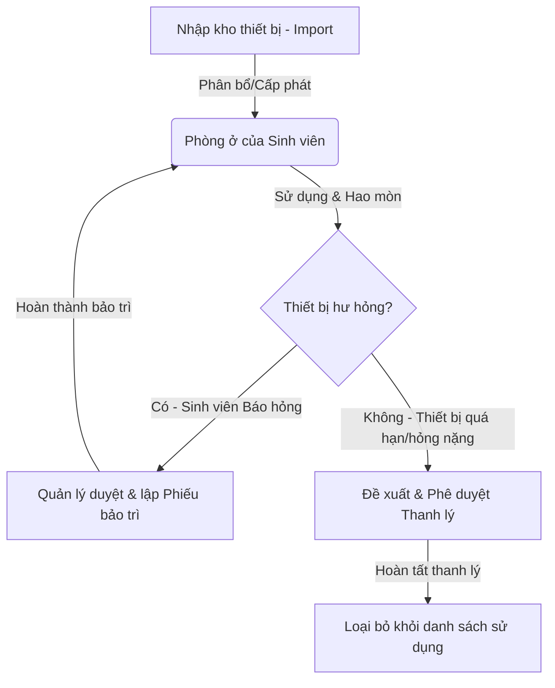

# Hệ thống Quản lý Cơ sở Vật chất Ký túc xá - PTIT HCM
https://github.com/iammintam5/dormitory-facility-management
Ứng dụng web quản lý tài sản, thiết bị, phòng ở, phân bổ sinh viên và toàn bộ các nghiệp vụ vận hành vòng đời cơ sở vật chất tại Ký túc xá PTIT HCM.

---

## 🏗️ Kiến trúc Hệ thống & Công nghệ Sử dụng

Hệ thống được chia thành hai phần độc lập liên kết qua REST API:

### 1. Backend API (`/backend`)
- **Framework**: [NestJS](https://nestjs.com/) (Node.js framework hỗ trợ kiến trúc mô-đun mạnh mẽ, bảo mật và dễ mở rộng).
- **Database ORM**: [Prisma](https://www.prisma.io/) kết nối cơ sở dữ liệu quan hệ **PostgreSQL**.
- **Xác thực & Phân quyền**: JSON Web Token (JWT) Bearer kết hợp Passport Guard.
- **Tiêu chuẩn dữ liệu**: `class-validator` & `class-transformer` xác thực dữ liệu chặt chẽ từ request (DTOs).

### 2. Frontend SPA (`/frontend`)
- **Library**: [React 18](https://react.dev/) + **TypeScript** (đảm bảo kiểm soát kiểu dữ liệu an toàn).
- **Công cụ Build**: **Vite** (tối ưu hóa tốc độ build và hỗ trợ HMR siêu tốc).
- **Styling**: **Tailwind CSS** (giao diện responsive, mượt mà với tông màu hiện đại, chuyên nghiệp).
- **Charts**: **Recharts** trực quan hóa các dữ liệu thống kê tài sản, phòng ốc và báo cáo hỏng.

---

## 👥 Vai trò & Phân quyền Chi tiết (Role Matrix)

Hệ thống hỗ trợ 3 nhóm vai trò chính được phân quyền rõ ràng từ tầng Frontend đến API:

| Tính năng | ADMIN | MANAGER (Quản lý) | STUDENT (Sinh viên) |
| :--- | :---: | :---: | :---: |
| **Tổng quan (Dashboard)** | Xem thống kê hệ thống | Xem biểu đồ & thống kê KTX | Xem thông tin phòng & tài sản |
| **Quản lý tài khoản & User** | Toàn quyền (Thêm/Sửa/Đổi Pass) | Không có quyền | Xem/Sửa thông tin cá nhân |
| **Xem Audit Logs** | Toàn quyền xem vết hệ thống | Không có quyền | Không có quyền |
| **Quản lý Tòa nhà & Phòng** | Không có quyền | Toàn quyền (Thêm/Sửa/Xếp phòng) | Xem thông tin phòng hiện tại |
| **Quản lý Loại & Tài sản** | Không có quyền | Nhập kho/Xuất kho/Cấp phát | Xem tài sản được giao trong phòng |
| **Xử lý Báo hỏng (Damage)** | Không có quyền | Duyệt báo hỏng/Lập lịch sửa chữa | Gửi báo hỏng & Theo dõi tiến độ |
| **Quản lý Bảo trì & Thanh lý** | Không có quyền | Tạo phiếu bảo trì / Đề xuất thanh lý | Không có quyền |
| **Thông báo (Notifications)** | Xem thông báo hệ thống | Nhận thông báo báo hỏng mới | Nhận thông báo cập nhật sửa chữa |

---

## 🔄 Vòng đời Quản lý Thiết bị trong Hệ thống

Quy trình quản lý tài sản khép kín đảm bảo không thất thoát thiết bị:


---

## 📁 Cấu trúc Thư mục Dự án

```text
Demo_CNPM/
├── backend/                  # Mã nguồn NestJS API
│   ├── prisma/               # Schema định nghĩa DB & file seed dữ liệu
│   ├── src/                  # Mã nguồn ứng dụng
│   └── package.json          # Các thư viện phụ thuộc phía Backend
├── frontend/                 # Giao diện React SPA
│   ├── src/                  # Components, Pages, Services, Router
│   ├── public/               # File tĩnh, biểu mẫu mẫu PDF
│   └── package.json          # Các thư viện phụ thuộc phía Frontend
└── README.md                 # Hướng dẫn chi tiết dự án
```

---

## 🚀 Hướng dẫn Cài đặt & Chạy ứng dụng

### Yêu cầu tiên quyết
- **Node.js**: Phiên bản 18+ hoặc 20+.
- **Database**: Hệ quản trị cơ sở dữ liệu **PostgreSQL** đang chạy.

---

### BƯỚC 1: Clone Source Code
Mở terminal và chuyển vào thư mục dự án:
```bash
git clone <repository-url>
cd Demo_CNPM
```

---

### BƯỚC 2: Cài đặt và Khởi tạo Backend

1. Di chuyển vào thư mục `backend`:
   ```bash
   cd backend
   npm install
   ```

2. Cấu hình biến môi trường:
   Tạo file `.env` nằm trong thư mục `backend/` dựa theo nội dung mẫu `.env.example`:
   ```env
   PORT=3000
   FRONTEND_URL=http://localhost:5173
   DATABASE_URL="postgresql://<username>:<password>@localhost:5432/<db_name>?schema=public"
   DIRECT_URL="postgresql://<username>:<password>@localhost:5432/<db_name>?schema=public"
   JWT_SECRET="super-secret-key-for-dormitory"
   JWT_EXPIRES_IN="1d"
   ```
   *(Thay đổi `<username>`, `<password>` và `<db_name>` phù hợp với tài khoản PostgreSQL của bạn)*.

3. Đồng bộ Database & Seed dữ liệu mẫu:
   ```bash
   # Đồng bộ cấu trúc bảng vào PostgreSQL
   npm run prisma:migrate

   # Đổ dữ liệu mẫu (Tài khoản, Phòng, Thiết bị mẫu)
   npm run prisma:seed
   ```

4. Khởi động Backend server (chế độ phát triển):
   ```bash
   npm run start:dev
   ```
   API Server sẽ chạy tại: `http://localhost:3000`

---

### BƯỚC 3: Cài đặt và Khởi chạy Giao diện Frontend

1. Mở một terminal mới và di chuyển vào thư mục `frontend`:
   ```bash
   cd frontend
   npm install
   ```

2. Cấu hình biến môi trường:
   Tạo file `.env` nằm trong thư mục `frontend/` tương ứng với `.env.example`:
   ```env
   VITE_API_BASE_URL=http://localhost:3000
   ```

3. Khởi chạy ứng dụng:
   ```bash
   npm run dev
   ```
   Ứng dụng sẽ khả dụng trên trình duyệt tại địa chỉ: `http://localhost:5173`

---

## 🔑 Danh sách Tài khoản Kiểm thử (Test Accounts)

Sau khi chạy lệnh `npm run prisma:seed`, hệ thống đã có sẵn các tài khoản để đăng nhập kiểm tra:

| Vai trò | Username | Mật khẩu | Chức năng kiểm thử chính |
| :--- | :--- | :--- | :--- |
| **Admin** | `ADMIN001` | `123456` | Quản lý người dùng, xem lịch sử nhật ký tác động (Audit log). |
| **Quản lý** | `QL001` | `123456` | Quản lý phòng ở, cấp phát/thu hồi thiết bị, lập phiếu bảo trì, thanh lý. |
| **Sinh viên** | `SV20230001` | `123456` | Xem thiết bị trong phòng, gửi báo cáo hỏng thiết bị trực tuyến. |

---

## 🛠️ Các Lệnh Phát triển Hữu ích khác

### Phía Backend:
```bash
npm run build          # Biên dịch dự án NestJS sang Javascript
npm run prisma:studio  # Mở giao diện quản trị DB trực quan của Prisma
```

### Phía Frontend:
```bash
npm run build          # Biên dịch và tối ưu hóa mã nguồn Frontend để nộp bài
npm run preview        # Chạy thử bản build Frontend tại local
```
